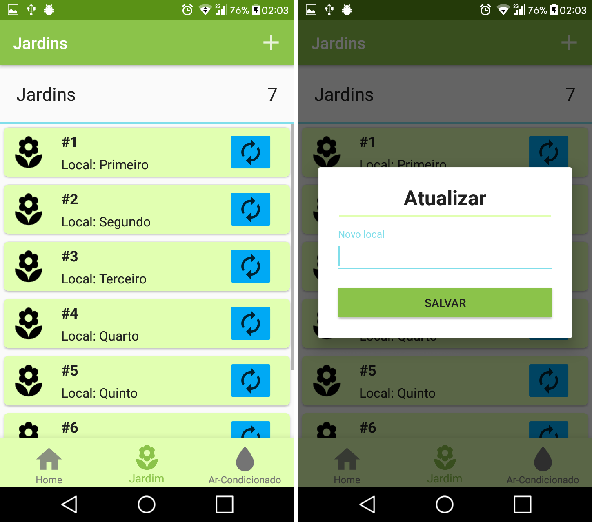
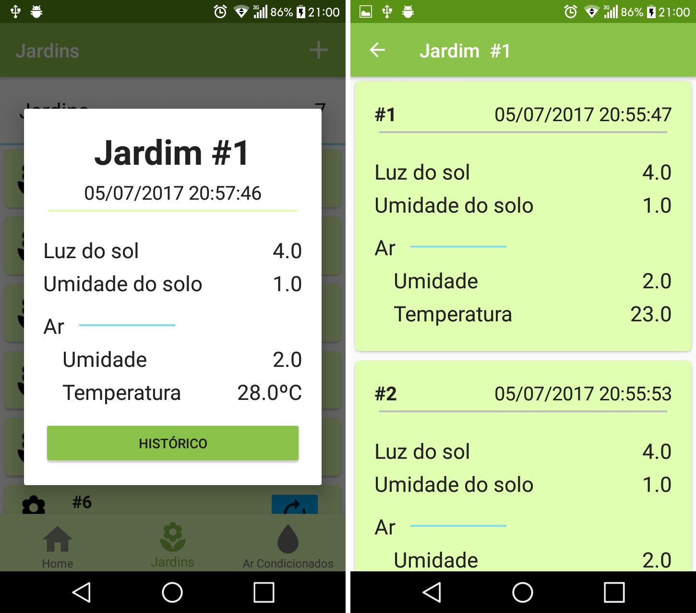

  

<h1 align="center">
  Celebino Graduation project in computer technician at 
  <a href="http://www.ifpb.edu.br/campinagrande" alt="ifpb-cg">IFPB-CG</a>
</h1>

  
  
  

## :page_facing_up: Abstract
  Water scarcity is impacting all the world, and though Brazil is considered the
bigger hydric potency in the planet, with it it’s not different. Looking at the IFPB-CG, an
institution which has numerous classrooms with air-conditioning system that drops
water when are turned on, was thought a method to reuse this water in irrigation of
garden plants and storage. However it is necessary to execute a better automatic
control of the gathered water in this process, as well to monitor the garden and plants
statuses for a better exploitation. Therefore, the objectives of this project is to develop
a monitoring system of gathering and reuse of water in gardens. The data will be
collected by microcontrollers and will be able to be visualized in an android application.
For a better organization in its development, the project was split in three modules:
arduino, service and android client.
Keywords: reuse, monitoring, air-conditioning, garden, android application, arduino,
service.

### [Full documentation here](https://drive.google.com/file/d/0B8KUsVYhoQaFRjU2ay1qd1I2MFo3TzhzakM0QXNUMFBIRVdN/view?usp=sharing)
  
## :camera: [Screenshots](https://github.com/MrH3nry/Celebino/tree/master/Design/Screenshots)

   
   
  

